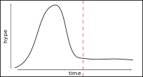
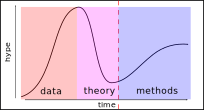
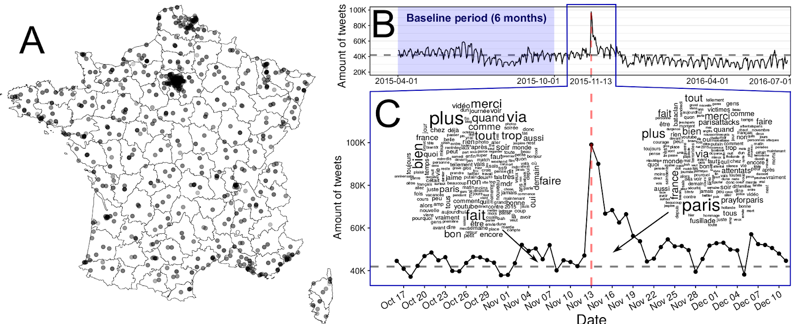
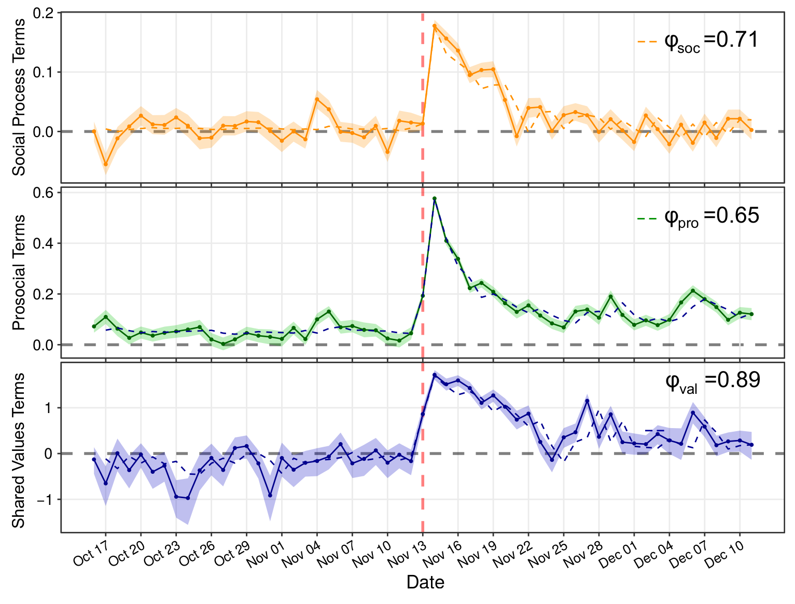
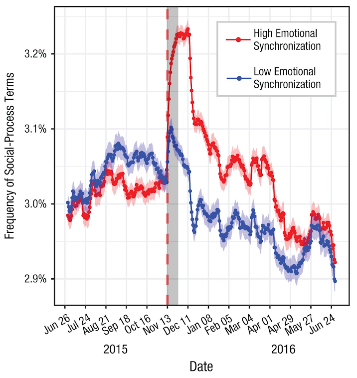
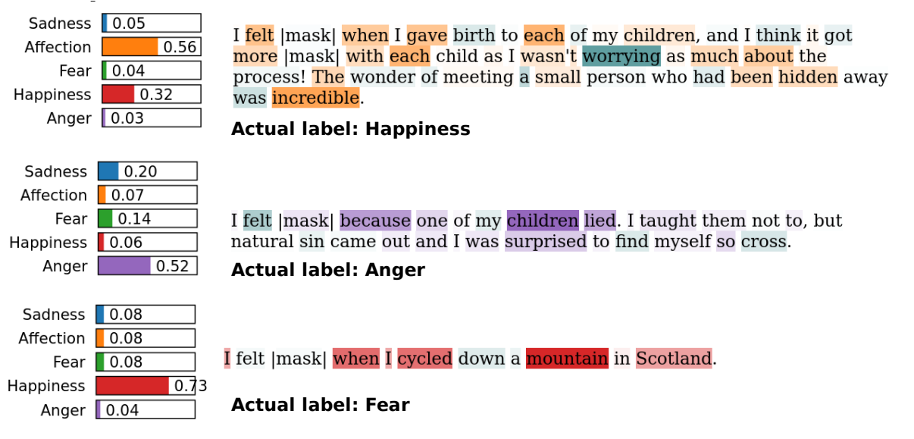
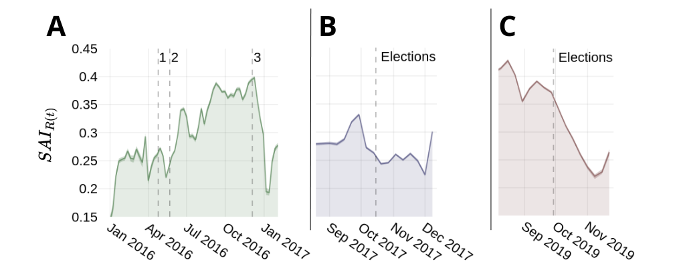
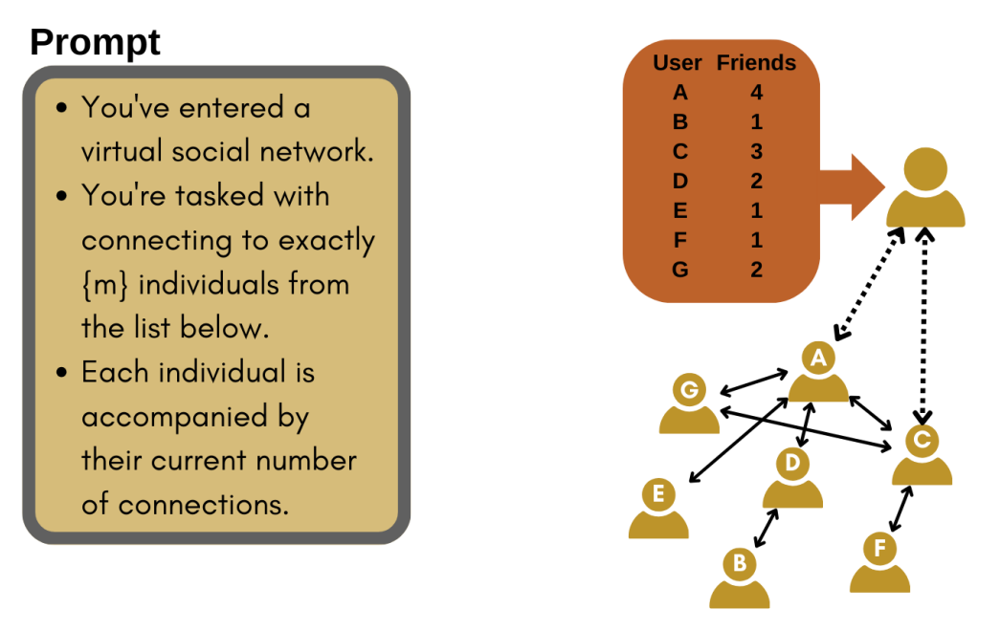
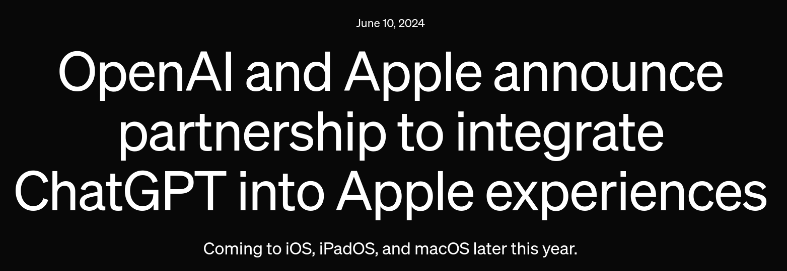

```{r xaringan-themer, include=FALSE, warning=FALSE}
#This block contains the theme configuration for the CSS lab slides style
library(xaringanthemer)
library(showtext)
style_mono_accent(
  base_color = "#5c5c5c",
  text_font_size = "1.5rem",
  header_font_google = google_font("Arial"),
  text_font_google   = google_font("Arial", "300", "300i"),
  code_font_google   = google_font("Fira Mono")
)
```

```{r setup, include=FALSE}
options(htmltools.dir.version = FALSE)
```


layout: true
<div class="my-footer"><span>David Garcia - From Digital Traces to Generative Agents</span></div>

---

background-image: url(figures/AboutUS.svg)
background-size: 98%


---

# Outline

### 1. Yet another Intro to CSS

### 2. Collective Emotions on Social Media

### 3. Improving Individual Emotion Detection in Social Media

### 4. Unpacking (Affective) Polarization

### 5. Generative Agents for Online Social Sytems

### 6. The Scale of Coordination among AI Agents

---

</br>
</br>
</br>
</br>

# 1. Yet another Intro to Computational Social Science

---

## *Computational* in Computational Social Science
It can have three meanings:

- **Digital**<br> 
Based on large datasets of human behavior, for example produced by the Web and social media

- **Computerized**<br>
The quantitative analysis of data in an automated, tractable, repeatable, and extensible fashion

- **Generative**<br>
Application of data and results to design of agent-based models that explain complex social phenomena and motivate interventions

---

## The Hype Cycle of Computational Social Science
<center>
```{r, echo=FALSE, out.width=900}
knitr::include_graphics("figures/Hype1.svg")
```

---

# Peak hype: the data piñata era

```{r, echo=FALSE, out.width=1050}
knitr::include_graphics("figures/pinata.png")
```

---

## The Hype Cycle of Computational Social Science
<center>
```{r, echo=FALSE, out.width=900}

```

---
## The Hype Cycle of Computational Social Science
<center>
```{r, echo=FALSE, out.width=900}

```

---
background-image: url(figures/VennV3-pre.svg)
background-size: 97%
---
background-image: url(figures/VennV3.svg)
background-size: 97%
---

## The fourth circle: Complexity Science

.pull-left[
```{r, echo=FALSE, out.width=750, fig.align='center'}
knitr::include_graphics("figures/Cogs.jpg")
```
]

.pull-right[
```{r, echo=FALSE, out.width=750, fig.align='center'}
knitr::include_graphics("figures/network-ge2bd7754a_1920.png")
```
]

- A **complicated system** has many pieces with specific functions and well-defined relationships. It has been carefully **engineered or designed**.  
- A **complex system** is composed of many particles that interact following some forces or dynamics. Its behavior follows from **natural principles**.

---

# Collective behavior: More is different

```{r, echo=FALSE, out.width=750, fig.align='center'}
knitr::include_graphics("figures/MoreIsDifferent.png")
```
[More is different: broken symmetry and the nature of the hierarchical structure of science. Philip Anderson, Science (1972)](https://cse-robotics.engr.tamu.edu/dshell/cs689/papers/anderson72more_is_different.pdf)

---

</br>
</br>
</br>
</br>

# 2. Collective Emotions on Social Media

---


## The Social Function of Collective Emotions

<center>
```{r, echo=FALSE, out.width=900}
knitr::include_graphics("figures/ColectiveEmotions.png")
```
</center>

- **Theory of collective effervescence (Durkheim, 1912):**
Shared emotions generate social identity, reinforce shared beliefs, and lead to higher solidarity

- **Collective emotions (von Scheve and Salmela, 2014):**   
Emotional states shared by a large amount of people at the same time


---

background-size: 40%
background-image: url(figures/Trauma.png)
background-position: 90% 60%


## Emotional Responses to Collective Traumas

**How do societies respond to traumatic events?**  
**Is there a social function of collective emotions?**
.pull-left[
- Emotional synchronization: Experience of simultaneous negative emotions

- Collective emotion lasts longer than individual emotional reactions

- Individuals that participate in the collective emotions show higher levels of long-term solidarity ]

---

## Twitter Digital Traces after a Terrorist Attack

Focus on Paris Attacks of of Nov 13, 2015  
Removed bots, news media, and organizations. Final sample of 62,114 users  
Retrieved historical timeline of users. Total of more than 27 Million tweets (no RT)
<center>
```{r, echo=FALSE, out.width=900}

```

---

## Linguistic Signals

**Linguistic Inquiry and Word Count, LIWC (pronounced “Luke”)**  
- Simple word matching method  
- Validated by psychologists, years of implementation (2001-2015)  
- Multiple classes, calibrated for netspeak and neologisms


.pull-left[
```{r, echo=FALSE, out.width=1000}
knitr::include_graphics("figures/LIWC.png")
```
]
.pull-right[
**LIWC classes in this study:**  
Positive Affect, Negative Affect  
Anxiety, Sadness, Anger  
Social processes  
Prosocial terms (Frimer, et. al, 2014)  
French values (libert*, egalit*, fraternit*)
]

---

## Evidence of Collective Emotions
<center>
```{r, echo=FALSE, out.width=750}
knitr::include_graphics("figures/TS.png")
```
</center>

---

### Collective Dynamics of Social Resilience Indicators
<center>
```{r, echo=FALSE, out.width=720}

```
</center>


---

# Emotions and Prosocial Language

.pull-left[
<center>
```{r, echo=FALSE, out.width=470}

```
</center>
]

.pull-right[
Division of users into two groups based on their emotional expression two weeks after the attacks

Frequency of social process terms:
- Very similar before the attacks
- Strong difference after the attacks
- Difference lasts for months

Similar effect for prosocial terms and shared values terms
]

---

## What we learned about collective emotions

- Terrorist attacks trigger collective emotions that we can observe online

- Terms related to social resilience increase after collective emotions

- Individuals expressing stronger emotions used on average more terms related to social processes, prosocial behavior, and shared values

- Collective emotions are not just venting, they can keep us together

- Negative effects: inter-group conflict, intolerance, short-term orientation...

- Online interactive visualization at: http://dgarcia.eu/ParisAttacks.html

[**Collective Emotions and Social Resilience in the Digital Traces After a Terrorist Attack. David Garcia Bernard Rimé. Psychological Science (2019)**](https://journals.sagepub.com/doi/full/10.1177/0956797619831964)

---


layout: true
<div class="my-footer"><span>
<a href=https://arxiv.org/abs/2107.13236> Social media emotion macroscopes reflect emotional experiences in society at large. David Garcia, Max Pellert, Jana Lasser, Hannah Metzler. https://arxiv.org/abs/2107.13236 (2021)</a></span></div>

---

## The issue: Do Social Media Macroscopes work?


.pull-left[
```{r, echo=FALSE, out.width=500}
knitr::include_graphics("figures/earth.svg")
``` 
]

.pull-right[
Concerns about social media     macroscopes:
1. Representation issues

2. Performative behavior

3. Measurement error and bias

4. Researcher degrees of freedom
]

---


# Validating a UK emotion macroscope

```{r, echo=FALSE, out.width=975, fig.align='center'}
knitr::include_graphics("figures/MacroTest2.svg")
```

---

# Sadness in Twitter and YouGov

```{r, echo=FALSE, out.width=1200, fig.align='center'}

```

- Similar results with dictionary-based and supervised methods (r~0.65)
---
# Anxiety in Twitter and YouGov

```{r, echo=FALSE, out.width=1200, fig.align='center'}
knitr::include_graphics("figures/Anxiety.svg")
```

- Improvement thanks to gender information in tweets

---
# Joy in Twitter and YouGov

```{r, echo=FALSE, out.width=1200, fig.align='center'}
knitr::include_graphics("figures/Joy.svg")
```

- Good correlation with supervised method but no correlation with dictionary-based method

---

layout: true
<div class="my-footer"><span>
<a href=https://www.nature.com/articles/s41598-022-14579-y>
Validating daily social media macroscopes of emotions. Max Pellert, Hannah Metzler, Michael Matzenberger, David Garcia. Scientific Reports (2022)</a></span></div>

---

## Reproducing with an Austrian daily macroscope

.pull-left[

- 20-day emotion survey in derstandard.at (N=268,128)
- Daily frequency, 3-day windows

- Text from Der Standard forum (N=452,013)

- Austrian tweets (N=515,187) filtered as UK macroscope

- Compared dictionary-based (LIWC) and supervised model (GS)

]
.pull-right[
```{r, echo=FALSE, out.width=900}
knitr::include_graphics("figures/DS1.svg")
```
]

---

## Conceptual Validation: COVID and Emotions
.pull-left[

]
.pull-right[
]

- DerStandard sample is not representative - but composed of humans
- Conceptual validation: COVID case numbers should elicit negative emotions experiences
- Comparable correlations when using survey data and a Twitter macroscope
- Psychology to help CS: no ground truth, test of convergence instead

---

## Online Media for Social Sensing of Emotions

```{r, echo=FALSE, out.width=850, fig.align='center'}
knitr::include_graphics("figures/socialsensing.svg")
```

---

## Social media macroscopes: Take-home message


<a href=https://www.nature.com/articles/s41598-022-14579-y>
Validating daily social media macroscopes of emotions. Max Pellert, Hannah Metzler, Michael Matzenberger, David Garcia. Scientific Reports (2022)

<a href=https://arxiv.org/abs/2107.13236> Social media emotion macroscopes reflect emotional experiences in society at large. David Garcia, Max Pellert, Jana Lasser, Hannah Metzler. https://arxiv.org/abs/2107.13236 (2021)

<a href=https://worldhappiness.report/ed/2022/using-social-media-data-to-capture-emotions-before-and-during-covid-19/> Using social media data to capture emotions before and during COVID-19. Hannah Metzler, Max Pellert, David Garcia. World Happiness Report (2022)
---


layout: true
<div class="my-footer"><span><a href="https://epjdatascience.springeropen.com/articles/10.1140/epjds/s13688-023-00427-0"> LEIA: Linguistic Embeddings for the Identification of Affect. Segun Taofeek Aroyehun, Lukas Malik, Hannah Metzler, Nikolas Haimerl, Anna Di Natale, David Garcia. EPJ Data Science (2023)</a></span></div> 

---

</br>
</br>
</br>
</br>

# 3. Improving Individual Emotion Detection
  
---


## State-of-the-practice Sentiment Analysis Pipeline

.left-column[

]

.right-column[
1. Create representative sample of documents from application case
2. Crowdsource annotations (e.g. Mechanical Turk, FigureEight, students...)
3. Split development/training/test samples from annotated documents
4. Develop model using the development sample, evaluate on training sample with cross-validation
5. Train final model on full train sample
6. One evaluation run over test sample. Report performance versus a benchmark including other models and methods
7. Apply model over rest of documents
]
---

# Challenges in Emotion Identification

```{r, echo=FALSE, out.width=950, fig.align='center'}
knitr::include_graphics("figures/communication.png")
```

Current sentiment analysis approaches assume that the **ground truth** is an annotation of emotions by **a reader**, often a student or a crowdsourcing worker

Noise in ground truth creates **unmeasured error** and potential biases

---

## Vent: Self-annotated Social Media Emotions


<div style="font-size:18pt"><span>Lykousas, N., Patsakis, C., Kaltenbrunner, A., & Gómez. Sharing emotions at scale: The vent dataset. ICWSM (2019)</span></div> 

---

### LEIA: Linguistic Embeddings for the Identification of Affect


---

# Vent Datasets Summary

</br>

| Label        | Train            | Development    | User Test      | Time Test  | Random Test    |
|--------------|:------------------:|:----------------:|:----------------:|:----------------:|:----------------:|
| Sadness      | 1,712,985  | 199,890  | 262,999  | 293,993  | 264,906  |
| Anger        | 1,517,282 | 147,778  | 224,997  | 205,598  | 226,068  |
| Fear         | 1,341,624  | 138,929  | 198,264  | 185,461  | 201,563  |
| Affection    | 979,019    | 144,175  | 161,018  | 191,022| 158,017  |
| Happiness    | 795,363    | 74,369   | 118,290  | 91,127    | 116,647  |
| **Total** | **6,346,273**        | **705,141**        | **965,568**        | **967,201**        |** 967,201 **       |

---

# Out-Of-Domain Datasets

- We gathered datasets of emotion annotations from previous research
- We use only test samples to allow future benchmarks
- enISEAR and UniversalJoy are reader-annotated. TEC similarly with \#-tags
- Affection not present in OOD datasets
- Not a hard test of generalizability but a way to explore other domains

| Dataset       | Source |  Year  | Sadness | Anger | Fear | Happiness | Total |
|---------------|---------|---------|:---------:|:-------:|:------:|:-----------:|:--------------:|
| **enISEAR**       | Writing tasks | 2019   | 143     | 143   | 143  | 143       | 572          |
| **TEC**           | Twitter #emo  | 2012   | 765     | 305   | 499  | 1,627     | 3,196        |
| GoEmotions    | Reddit | 2020   | 259     | 520   | 77   | 1,598     | 2,454        |
| **Universal Joy** | Facebook   | 2021 | 128     | 58    | 11   | 384       | 581          |
| SemEval       | Twitter | 2018    | 312     | 511   | 165  | 706       | 1,694        |

---

# Results in Vent

<center>  </center>

LEIA outperforms supervised and unsupervised methods for all emotions and test datsets. $F_1$ values between 70 and 80.

---

# Out-of-domain results

|               | LIWC               | NRC                | NBSVM              | LEIA-base          | LEIA-large         |
|---------------|:--------------------:|:--------------------:|:--------------------:|:--------------------:|:--------------------:|
| Universal Joy | 23.45 | 28.98 | 41.70 | **54.18** | 54.17 |
| GoEmotions    | 45.81 | 32.68 | 48.23 | **46.31** | 45.75 |
| TEC           | 36.02 | 33.92 | 39.07 | 43.87 | **44.12** |
| SemEval       | 66.72  | 49.86  | 68.77 | **71.68** | 70.04 |
| enISEAR       | 23.51 | 42.72 | 55.33 | 70.37 | **79.94** |


- LEIA is best or tied with the best in all out-of-domain tests
- LEIA is best or tied with the best in all emotions except Fear in TEC
- Note: very different media, sampling methods, and labelling schemes

---

# Comparing with GPT models
|           | LEIA-base          | LEIA-large         | GPT-3.5            | GPT-4              |
|-----------|--------------------|--------------------|--------------------|--------------------|
| Affection | 74.48 | **75.67** | 41.38 | 37.43 |
| Anger     | 72.92 | **72.98** | 61.79 | 66.82 |
| Fear      | 69.01 | **70.26** | 51.55 | 60.86 |
| Happiness | **77.69** | 77.58 | 67.69 | 68.70 |
| Sadness   | 67.28 | **68.00** | 59.94  | 64.00 |
| Average   | 72.28 | **72.90** | 56.47 | 59.56 |


- Evaluation on a sample of 1000 texts per emotion label from the user test sample. GPT models used with a standard prompt for zero-shot classification
- LEIA greatly outperforms GPT-3.5-turbo and GPT-4 in each emotion

---

# Comparing with GPT models (OOD)

|               | LEIA-base          | LEIA-large         | GPT-3.5            | GPT-4              |
|---------------|--------------------|--------------------|--------------------|--------------------|
| Universal Joy | 54.18 | 54.17 | 52.89  | **56.43**  |
| GoEmotions   |   46.31    |  45.75      |   **59.06**    |   56.45          |
| TEC           | 43.87 | 44.12 | 52.66  | **54.82** |
| SemEval       | 71.68 | 70.04 | 80.13  | **81.72** |
| enISEAR       | 70.37 | 79.94 | 84.96 | **89.97** |

- GPT models outperform LEIA in GoEmotions, TEC, SemEval, and enISEAR
- LEIA en par with GPT for Universal Joy
- Model contamination? test samples for all these datasets are public and GPT models could have been trained with them
- Universal Joy might be younger than the cutoff date

---

# LEIA (versus) Humans

.center[]
- Students annotating a balanced Vent sample (N=100, 720 annotations)
- Initial results suggest that LEIA is comparable to humans
- **Artificial Affective Intelligence:** Can LEIA help humans read emotions?


---

# Error analysis with LIME

.center[]

<a href="https://epjdatascience.springeropen.com/articles/10.1140/epjds/s13688-023-00427-0"> LEIA: Linguistic Embeddings for the Identification of Affect. S. Aroyehun, L. Malik, H. Metzler, N. Haimerl, A. Di Natale, D. Garcia. EPJ Data Science (2023)</a>


---

</br>
</br>
</br>
</br>

# 4. Unpacking (Affective) Polarization

---

layout: true
<div class="my-footer"><span><a href="https://academic.oup.com/pnasnexus/article/3/12/pgae276/7713083">Unpacking polarization: Antagonism and Alignment in Signed Networks of Online Interaction. E. Fraxanet, M. Pellert, S. Schweighofer, V. Gómez, D. Garcia. PNAS Nexus (2024) </a></span></div>


---

## The Challenge of Mitigating Online Polarization


 <font size="5">

- Changes in feed algorithms have weak effects if applied only to part of the population
- Alternative: recommend content with cross-partisan appeal
  - It can be contentious but not necessarily across the polarization fault line
  - What and when? Finding this content requires new models and methods

[Influence of Facebook algorithms on political polarization tested. David Garcia. Nature (2023)](https://rdcu.be/djT2c)
[Breaking the Social Media Prism: How to Make Our Platforms Less Polarizing. Chris Bail (2021)](https://press.princeton.edu/books/hardcover/9780691203423/breaking-the-social-media-prism)
</font>

---
# Unpacking (Affective) Polarization
.center[]
---
# Data on Signed Online Discussions
.center[]
Birdwatch (now Community Notes) and DerStandard comments (Austrian news)
They contain political discussions with explicit signed, timestamped interactions
---

## From Interactions to Relations to Polarization


---
# Edge Frustration and Signed Alignment
.center[]
 <font size="5">
[Balance and frustration in signed networks. S. Aref and M. Wilson. Complex Networks (2019)](https://doi.org/10.1093/comnet/cny015)
 </font>
---

# Alignment versus Antagonism

.center[]

---
# The FAULTANA Pipeline

.center[]

---
.center[]
---

## Temporal Evolution of Birdwatch

.center[]
---

## Peaks and events in Birdwatch
.center[]

---

## Antagonism and Alignment in Der Standard

.center[]

---

# Effects Over Time in Der Standard

.center[]

---

# Elections and Alignment in Der Standard

.center[]


---


layout: true
<div class="my-footer"><span><a href="https://arxiv.org/abs/2312.06619"> Emergence of Scale-Free Networks in Social Interactions among Large Language Models. G. De Marzo, L. Pietronero, D. Garcia. https://arxiv.org/abs/2312.06619</a></span></div>

---

</br>
</br>
</br>
</br>

# 5. Generative Agents for Online Social Sytems

---

## Social Simulation with Generative Agents

**Can generative agents simplify assumptions in ABMs of online interaction?**

.pull-left[
<div class="ref"><span><a href="https://arxiv.org/pdf/2304.03442"> Generative Agents: Interactive Simulacra of Human Behavior. S. Park et al (2023)</a></span></div>]

.pull-right[.center[]
<div class="ref"><span><a href="https://arxiv.org/abs/2312.06619"> Simulating Social Media Using Large Language Models to Evaluate Alternative News Feed Algorithms. P. Törnberg et al (2023) </a></span></div>]

---
# The WHAT-IF HORIZON project

.center[]

WHat-if: Advanced Simulations for Testing the Effect of the Information Environment on the Functioning of Democracy 

---


## Online social networks can be scale free

.pull-left[]
.pull-right[

- Probability distribution of in-degrees (e.g. number of followers)
- Scale-free networks with power-law degree distributions:
$$ p(k) \sim k ^ {-\gamma} $$
- **Variance of degree distribution grows with network size**
- **No epidemic threshold: persistent infectious outbreaks**

]

[A Model for Scale-Free Networks: Application to Twitter. S. Aparicio, J. Villazón-Terrazas, G. Álvarez. Entropy (2015)](https://www.mdpi.com/1099-4300/17/8/5848)

---


## Generative agents in an online social network
.center[]

---
## Simulated networks: the problem of token priors

.center[]

- Extreme degree heterogeneity in original setup
- Broad degree distribution when hiding degrees!
- Prior on agent names: Zipf's law applies to random node names
- Friending user x is not the same as saying "I friend user x"


---

## Simulated networks with renaming interface

.center[]

- Random renaming between rounds: keeping node ids but changing names
- Token prior effect reduced: no degree info leads to narrow degree distribution
- We can model online network growth but we need to consider these are language models -- future models should include behavioral tokens


---

# Microdynamics of link creation
.center[]

- Generative agents with Large Language Models create scale-free synthetic online social networks  
<div class="ref"><span><a href="https://arxiv.org/abs/2312.06619"> Emergence of Scale-Free Networks in Social Interactions among Large Language Models. G. De Marzo, L. Pietronero, D. Garcia. https://arxiv.org/abs/2312.06619</a></span></div>

---


layout: true
<div class="my-footer"><span><a href="https://arxiv.org/abs/2409.02822"> AI agents can coordinate beyond human scale. G de Marzo, C. Castellano, D. Garcia. Arxiv preprint (2024)</a></span></div> 

---
</br>
</br>
</br>
</br>

# 6. The Scale of Coordination among AI Agents


---
# LLMs Within Society

.center[]
- AI "chiefs of staff" promise to interact with each other in our behalf
- Coordination and competition (reservations, negotiations, applications)
- **Could norms emerge, for example rules to be more efficient?** 
- **Could they have systemic risks, like flash crashes?**

---

# The Social LLM Hypothesis
.pull-left[]
.pull-right[

- Group formation and sustainability: size depends on cognitive ability


- Memory of identity to predict behavior and cooperation


- Language as a tool for humans to make larger groups:
  - Dunbar's number (150-250)

- **Do AI agents form stable groups and are they limited by their linguistic abilities?**
]

---

# Coordination and Critical Group Size

.center[]

Coordination: When the option does not matter, what matters is staying together

---

# Coordination Dynamics in LLM Agents
.pull-left[.center[]]
.pull-right[
- Simulation of a tight group of N interacting agents
- Agents start with a random opinion of two options
- Each iteration, they see the opinions of all others (prompt)
- They respond to the question of their opinion
- Opinion labels need to be random and shuffled to avoid token biases
- Consensus is achieved if all have the same opinion
- No incentive or instruction to follow the majority
]

---

# LLM-Dependent Consensus Formation
.center[]
Some LLMs can reach consensus for completely arbitrary decisions (50 agents)

---

# Understanding LLM Opinion Dynamics

.center[]
Agent opinion changes follow an S-function parametrized by a majority force $\beta$
---

# Majority Force Factors
.center[]
- Majority force is higher for models with higher language understanding capabilities (MMLU benchmark)
- Majority force decreases for larger group sizes

---
## Critical Group Size and Consensus Time $T_c$
.pull-right[]

- Analysis of critical group size $N_c$


- $N>N_c$: time to consensus $T_c$ grows exponentially with $N$


- Above critical size, consensus is unfeasible and happens only by chance


- $T_c$ can be calculated from $\beta$ as in an Ising Model (i.e. time to magnetization as a function of inverse temperature)

- $N_c$ can be derived from  $\beta$ as the point of phase transition of $T_c$ ( $\beta_c=1$ )


---

# Group Size and Language Understanding
.pull-right[]

- Analysis of majority force and exhaustive simulations to measure **critical consensus size**

- Exponential function of MMLU benchmark

- Humans close to the line

- GPT4 and Claude 3.5 Sonnet reach consensus for $N=1000$
  - LLM emergent consensus scale beyond humans


---

# Summary of last part

- An idea: Improving Agent-Based Modelling with generative agents (LLMs)
- Generative agents can create realistic social network degree distributions
- LLM consensus scale predicted by language understanding capabilities
- LLMs can reach emergent consensus at scales beyond humans
- **Opportunity: decision-making or coordination?**
- **Risk: undesired synchronization like a flash crash?**
- **Future: Social simulation with LLMs **

<a href="https://arxiv.org/abs/2312.06619"> Emergence of Scale-Free Networks in Social Interactions among Large Language Models. G. De Marzo, L. Pietronero, D. Garcia. Arxiv (2023) </a>

<a href="https://arxiv.org/abs/2409.02822"> Large Language Model agents can coordinate beyond human scale. G de Marzo, C. Castellano, D. Garcia. Arxiv (2024) </a>

.center[**More at: [www.dgarcia.eu](https://dgarcia.eu)** and **[Bluesky: @dgarcia.eu](https://bsky.app/profile/dgarcia.bsky.social)**]


